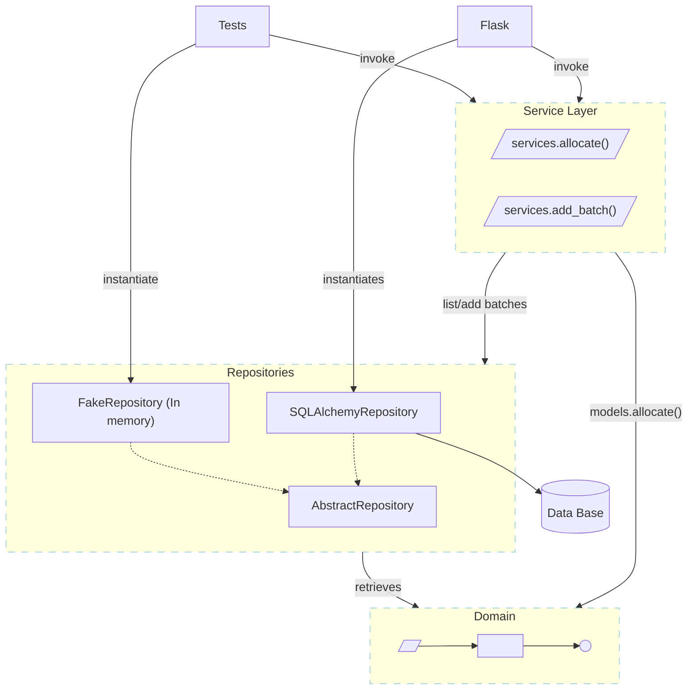

# Service Layer

## The new model

The service layer will become an entry point to the application.
Service layer will use repository class to get and save instances of the domain model objects.

## Application Logic

Previously the whole logic not correlated with data persistence or not possible to encapsulate into model classes was placed directly in the api methods. This made our api methods complicated and long. It was also coupling our domain logic with Flask api logic. By introducing service layer abstraction we can decouple actions specific to REST API request handling and our domain data processing into separate modules. This way our api methods focus on handling REST API needs like request marshaling, response code preparation and error handling.

Ideally we should make sure to use primitive types for communication between api and service layer - this makes it easy to refactor and swap if needed. Right now it is still slightly coupled with the domain but it is going to change in the next chapters.

Service layer should return responses using primitive types also, it should also propagate unhandled exceptions to the api layer so that api can report error message to the consumers.

## Choosing a right place to put domain logic

Depending on particular case service layer might contain a lot of logic describing interaction between models or focus mainly on orchestration. There is no single pattern here. Both approaches have their cons and pros. Moving logic back and forth between models and service layer is also be quite easy so the final solution should be a result of trying out different implementations and choosing the one that works best for our needs.
